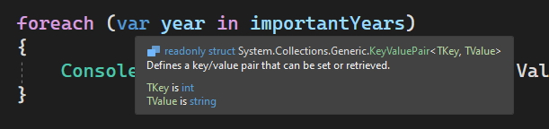

# Common Syntax

## Sets: Arrays

```csharp
    string data = "Alan,James,Charley,Ethan,Andrew";
    string[] firstNames = data.Split(',');

    Console.WriteLine($"The first name in the list is {firstNames[0]}");

    string[] lastNames = new string[] { "Robson", "Jones", "Smith", "James", "Brown" };
    Console.WriteLine($"Number of Strings: {lastNames.Length}");
    lastNames[1] = "Jameson";

    Console.WriteLine(lastNames[1]);
```

## Sets: Lists

``List<T>`` Where T is the type.

```csharp
    List<string> firstNames = new List<string>();

    firstNames.Add("Alan");
    firstNames.Add("James");
    firstNames.Add("Charley");
    firstNames.Add("Andrew");
    firstNames.Add("Ethan");
    firstNames.Add("Chris");

    Console.WriteLine($"The second name in the list is {firstNames[1]}");

    Console.WriteLine($"List count: {firstNames.Count}");

    firstNames.Remove("Chris");

    Console.WriteLine($"List count: {firstNames.Count}");
```

> **Tip:** ``List<T>`` is the most commonly used way to store a set of data.

## Sets: Dictionary

``Dictionary<int, string>`` 

* First value (``int``) is the **key** and it has to be unique. It can be of different types, not just ``int``.
* Second value (``string``) is the **value**.

```csharp
    Dictionary<int, string> importantYears = new Dictionary<int, string>();

    importantYears[1952] = "Alan is born.";
    importantYears[1968] = "Music from Big Pink is released.";
    importantYears[1966] = "Blonde On Blonde is released.";
    importantYears[1966] = "Live at Royal Albert Hall is recorded.";

    Console.WriteLine($"In 1966 {importantYears[1966]}");
```

Returns:

> In 1966 Live at Royal Albert Hall is recorded.

This works but the initial 1966 key is overwritten with the last key. So the List Of ``importantYears`` is unique and doesn't contain ``importantYears[1966] = "Blonde On Blonde is released.";``.

> **Tip:** A Dictionary cannot have two keys that are the same.

### Run with an employeeId = 7

```csharp
    Dictionary<int, string> employees = new Dictionary<int, string>();

    employees[1] = "Alan";
    employees[2] = "Charley";
    employees[3] = "James";
    employees[4] = "Ethan";
    employees[5] = "Andrew";

    int employeeId = 7;

    if (employees.ContainsKey(employeeId))
    {
        Console.WriteLine($"Employee with Id {employeeId} is: {employees[employeeId]}.");
    }
    else
    {
        Console.WriteLine($"An employee with Id: {employeeId} doesn't exist.");
    }
```

Result:

> An employee with Id: 7 doesn't exist.

### Run with an employeeId = 1

Result:

> Employee with Id 1 is: Alan.

### Iterate over a Dictionary

```csharp
    Dictionary<int, string> importantYears = new Dictionary<int, string>();

    importantYears[1952] = "Alan is born.";
    importantYears[1968] = "Music from Big Pink is released.";
    importantYears[1966] = "Blonde On Blonde is released.";
    
    foreach (var year in importantYears)
    {
        Console.WriteLine($"{ year.Key }: { year.Value }");
    }
```

Returns:

> 1952: Alan is born.
> 1968: Music from Big Pink is released.
> 1966: Live at Royal Albert Hall is recorded.

This seems to work by magic. Why?

The answer is by using ``var`` you don't have to explicitly add a type. If you mouse over ``var`` you will see.



It is a type of ``struct``.

### Add a list of family names and iterate through them

```csharp
    int count = 0;
    var member = string.Empty;
    Dictionary<int, string> family = new Dictionary<int, string>(   

    do
    {
        count++;
        Console.Write("Enter a family name: ");
        member = Console.ReadLine();
        if (member == string.Empty)
        {
            break;
        }
        
        family[count] = member;
    } while (true)

    foreach (var name in family)
    {
        Console.WriteLine(name.Value);
    }
```

Results:

> Enter a family name: Alan
> Enter a family name: James
> Enter a family name: Charley
> Enter a family name: Ethan
> Enter a family name: Chris
> Enter a family name: Andrew
> Enter a family name:
> Alan
> James
> Charley
> Ethan
> Chris
> Andrew
