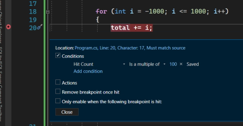
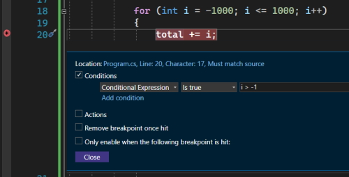
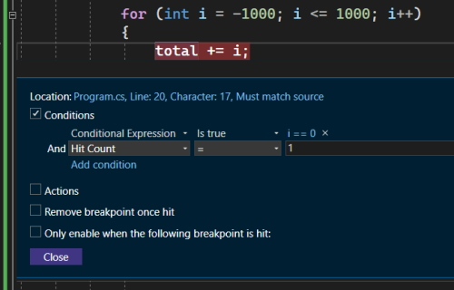
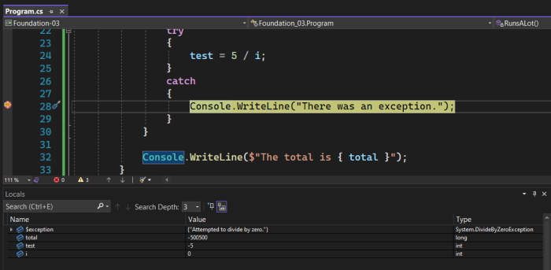
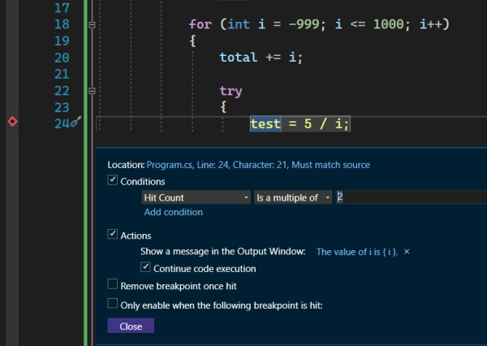
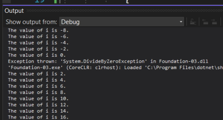
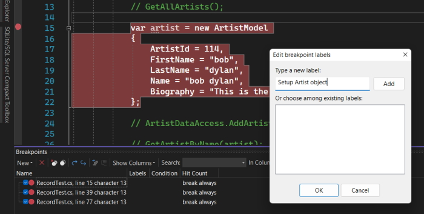

# Advanced Exceptions

You can create your own exceptions. Use this exception to warn the user that they have caused a problem.

```csharp
    static void Main(string[] args)
    {
        try
        {
            SimpleMethod();
        }
        catch (Exception ex)
        {
            Console.WriteLine(ex.Message);
        }
    }

    private static void SimpleMethod()
    {
        throw new InvalidOperationException("You should not be calling SimpleMethod");
    }
```

Returns.

> You should not be calling SimpleMethod

Adding the ``try-catch{}`` block around your method call allows the exception to bubble up and print out the exception in the console.

## using snippets

I want to add a ``try-catch{}`` block around ``SimpleMethod();``. To do this highlight the whole statement and right-click. On the menu there is an option for ``Snippet``, select ``Surround With`` and type ``try``.

This will surround the statement with a ``try-catch{}`` block.

## Catching different types of exceptions

We do have the option to catch more than one exception.

```csharp
	static void Main(string[] args)
	{
		try
		{
			SimpleException();
		}
		catch (InvalidOperationException ex) 
		{
			Console.WriteLine("You should not be calling these methods.");
		}
		catch (Exception ex)
		{
			Console.WriteLine(ex.Message);
		}		
	}
```

Returns.

> You should not be calling these methods.

In this case the exception bubbles up from the ``SimpleException()`` method and works its way through the ``catch{}`` blocks. It stops at the ``InvalidOperationException`` exception because that is the exception that was triggered and prints out that console message, not the message from the method ``SimpleMethod()``.

If it wasn't the exception that was triggered it will move down to the general exception.

**Note:** add the general exception last or you won't move down the ``catch{}`` blocks ie. from the most specific to the most general.

You could also return both ``InvalidOperationException`` messages with this.

```csharp
	static void Main(string[] args)
	{
		try
		{
			SimpleException();
		}
		catch (InvalidOperationException ex) 
		{
			Console.WriteLine("You should not be calling these methods.");
			Console.WriteLine(ex.Message);
		}
		catch (Exception ex)
		{
			Console.WriteLine(ex.Message);
		}		
	}
```

Returns.

> You should not be calling these methods.
> You should not be calling SimpleMethod

## NotImplementedException

This is an exception that Microsoft add to a new generated method.

To see this add a method call in the ``try`` block of your code.

```csharp
    try
    {
        DifferentMethod();
        SimpleException();
    }
```

This method doesn't exist currently so you would see an error underneath it. Da a ``Ctrl .`` over the method statement and it will generate the method for you.

This is the code that is generated.

```csharp
    private static void DifferentMethod()
    {
        throw new NotImplementedException();
    }
```

Microsoft add the ``NotImplementedException`` exception for you. Most people will delete this line as soon as it is generated. That is a mistake.

For example remove this line and run the program.

You get the two ``InvalidOperationException`` messages but the program goes into the empty method call and works as normal.

```csharp
    private static void DifferentMethod()
    {
    }
```

It is much better to leave the exception line in your code until you finish writing the method. This way if you go out to lunch and forget to complete the method when you run the program you will get a ``NotImplementedException``. It tells you that the method is empty or isn't finished.

You can also add another ``catch{}`` block to catch this exception.

```csharp
	static void Main(string[] args)
	{
		try
		{
			DifferentMethod();
			SimpleMethod();
		}
		catch (NotImplementedException ex)
		{
			Console.WriteLine("You forgot to complete your code!!");
		}
		catch (InvalidOperationException ex) 
		{
			Console.WriteLine("You should not be calling these methods.");
			Console.WriteLine(ex.Message);
		}
		catch (Exception ex)
		{
			Console.WriteLine(ex.Message);
		}
	}
```

Returns.

> You forgot to complete your code!!

This is really handy to make sure you complete a method.

Add another method named ``ComplexMethod()``.

```csharp
	static void Main(string[] args)
	{
		private static void AdvancedExceptions()
		{
			try
			{
				DifferentMethod();
		
				Console.Write("What is your name? ");
				string name = Console.ReadLine();
		
				ComplexMethod(name);
				SimpleMethod();
			}
			catch (InvalidOperationException ex) 
			{
				Console.WriteLine("You should not be calling these methods.");
				Console.WriteLine(ex.Message);
			}
			catch (NotImplementedException ex)
			{
				Console.WriteLine("You forgot to complete your code!!");
				Console.WriteLine(ex.Message);
			}
			catch (Exception ex)
			{
				Console.WriteLine(ex.Message);
			}
		}
		
		private static void ComplexMethod(string name)
		{
			if (name.ToLower() == "alan")
			{
				throw new InsufficientMemoryException("Alan is too big for this method!!");
			}
			else
			{
				throw new ArgumentException("This person isn't Alan.");
			}
		}
	}
```

Returns.

> You forgot to complete your code!!
> The method or operation is not implemented.

It does the ``DifferentMethod()`` exceptions and then stops. The code doesn't percolate down to the exception for ``ComplexMethod()``. Why?

The reason is that C# will only produce one exception per block of code. In our ``try{}`` block we have three method calls and if there is an exception in the first method it will only work with that method and then quits. the rest of the ``try{}`` block is ignored so we don't get to add our name. The program then progresses down to the ``catch{}`` blocks and percolates until it finds first matching ``catch{}`` block.

Our way to fix this is to finish our method ``DifferentMethod()``.

```csharp
    private static void DifferentMethod()
    {
        Console.WriteLine("This is DifferentMethod working correctly.");
    }
```

Run the program again.

> This is DifferentMethod working correctly.
> What is your name? Alan
> Alan is too big for this method!!

It successfully completed ``DifferentMethod()`` and then ran ``ComplexMethod()``. When it hit the exception it bubbled up to the ``catch{}`` blocks and percolated through to the general exception.

If we run the program again and enter another name we will get the exception message, *This person isn't Alan.*.

## More advanced exceptions

You can also use where clauses in you ``catch{}`` blocks. Add another general exception and take the string ``name`` out of the ``try-catch{}`` block.

```csharp
		static void Main(string[] args)
		{
			string name = string.Empty;
	
			try
			{
				DifferentMethod();
	
				Console.Write("What is your name? ");
				name = Console.ReadLine();
	
				ComplexMethod(name);
				SimpleMethod();
			}
			catch (InvalidOperationException ex) 
			{
				Console.WriteLine("You should not be calling these methods.");
				Console.WriteLine(ex.Message);
			}
			catch (NotImplementedException ex)
			{
				Console.WriteLine("You forgot to complete your code!!");
				Console.WriteLine(ex.Message);
			}
			catch (Exception) when (name.ToLower() == "alan")
			{
				Console.WriteLine("You typed in Alan, didn't you?");
			}
			catch (Exception ex)
			{
				Console.WriteLine(ex.Message);
			}
		}
	
		private static void ComplexMethod(string name)
		{
			if (name.ToLower() == "alan")
			{
				throw new InsufficientMemoryException("Alan is too big for this method!!");
			}
			else
			{
				throw new ArgumentException("This person isn't Alan.");
			}
		}
	
		...
```

When you type in *Alan* you get the following results.

> This is DifferentMethod working correctly.
> What is your name? Alan
> You typed in Alan, didn't you?

We are using two general exceptions but one has a ``where`` clause attached and this is the one we hit.

**Note:** this is an exaggerated example. Usually you would only have one ``catch{}`` block, either a general or a specific exception.

## C# method exceptions

You can also work out what type of exception you should use for a particular method like *WriteLine()* or *ReadLine()*. Mouse over one of these methods and it will give you a list of exceptions that occur with these methods.

For example *WriteLine()* generates a ``System.IO.IO`` exception.

## finally

Another thing we can do is add a ``finally`` block to the end of the ``catch{}`` blocks.

``finally`` will run no matter what exceptions are called. We use this so that we can do some cleanup work. A good example of this is when you are doing some database work in a ``try{}`` block. In this case you could have connections left open so using a ``finally`` block could be used to shut the connections.

```csharp
    catch (Exception ex)
    {
        Console.WriteLine(ex.Message);
    }
    finally
    {
        Console.WriteLine("This will always work!");
    }
```

Returns.

> This is DifferentMethod working correctly.
> What is your name? Alan
> You typed in Alan, didn't you?
> This will always work!

## Advanced breakpoints

### Conditional breakpoints

The following code has a divide by zero error. If we were trying to debug through this code it would be an impossible task.

For example, we know the code fails on the statement ``test = 5 / i;`` and we want to add a breakpoint on the ``total += i;`` statement. It would take 999 iterations before we hit our error.

```csharp
	static void Main(string[] args)
	{
		RunsALot();
	}
	
	private static void RunsALot()
	{
		long total = 0;
		int test = 0;
	
		for (int i = -1000; i <= 1000; i++)
		{
			total += i;
	
			try
			{
				test = 5 / i;
			}
			catch
			{
				Console.WriteLine("There was an exception.");
			}
		}
	
		Console.WriteLine($"The total is { total }");
	}
```

We can set conditionals on our breakpoints.

Set a break point at ``total += i;``.

Right-click on the breakpoint dot and select conditions.

### Hit Count conditional



In this conditional we want to use ``Hit Count`` and we will make it a multiple of 100.

**Note:** our breakpoint is now a red circle with a black plus in it. This means that it is a counter breakpoint which means that it only breaks on certain circumstances.

When we hit ``F5`` and debug the code it will stop after the first 100th iteration (*i = 901*). Hit ``F5`` and it will iterate another 100 times (*i = 801*) and so on. We hit *-1* and then *99*. It is at this stage we get a console message telling us that *There was an exception.*

ie: the error happens between *-1* and *99*

From here we can go back to **Conditions** and add a new condition.



We know that the error occurs after *-1* so when we hit ``F5`` and continue to hit ``F5`` we will see the code increment by *1*. When we hit *0* we get the exception message.

We could also do this.


When we do this our first breakpoint is as 0. The next breakpoint will be 10 and this is where our exception pops up.

We could also guess where the error might occur.



Using two conditionals allows us to get more granular. We hit ``F5`` and *i = 0*. We then step into the ``try{}`` block and after we move past the *test = 5 / i;* statement we will move to our ``catch{}`` block and the exception statement gets printed.

There is another way to try and find an error. You have a ``catch{}`` block that writes an exception message. Put a breakpoint on that line and debug.



This gets straight to your error and you can see the problem with the ``i`` variable. You can also see the exception message.

### Actions

We can add an action to print out a message to the output.

**Note:** the red star denotes an action breakpoint



Produces this output.



### Breakpoints

You can open a breakpoints window that shows all of your breakpoints.

From the menu.

``Debug --> Windows --> Breakpoints``

Or

``Ctrl-ALt-B``

#### Labels

You can add a label to a breakpoint in the breakpoint window.



Name all of your breakpoints.


**Note:** if you had Action breakpoints they would also show up in this list.

You can also disable or delete breakpoints in the breakpoint window. You can also disable by label. You can search for labels and disable those labels. 

Another option is export all of your breakpoints and send them to another user who has the code. They can use your breakpoints to try and fix your problem.

You save your breakpoints as an ``XML`` file.

You can delete your breakpoints and then import them back from the file you saved.
