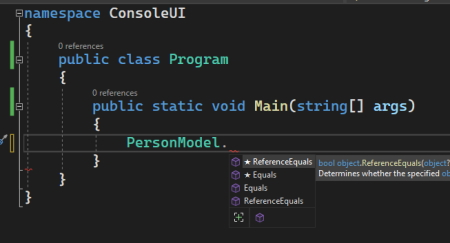
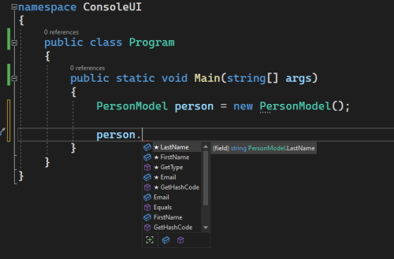
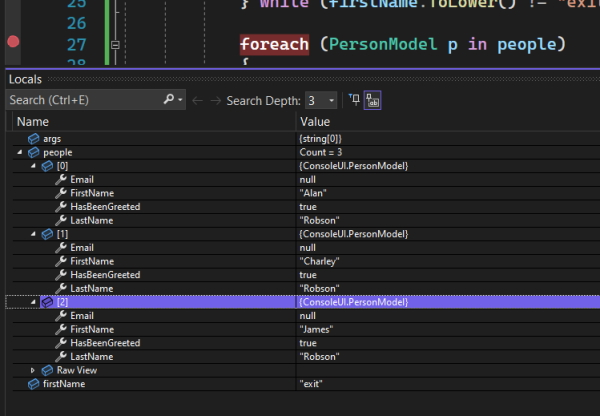
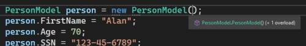
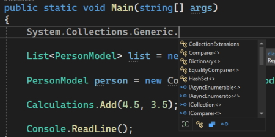
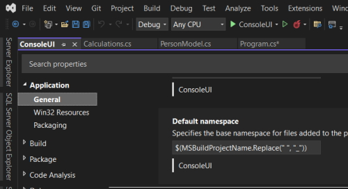

# Object Oriented Principles - Part 1

## Static Classes

We are going to start using static classes for this module.

We create a ``Program.cs`` class in a Console application.

```csharp
namespace ConsoleUI
{
    public class Program
    {
        public static void Main(string[] args)
        {
            string firstName = RequestData.GetName("What is your first name: ");

            UserMessages.ApplicationStartMessage(firstName);

            double x = RequestData.GetADouble("Please enter your first number: ");
            double y = RequestData.GetADouble("Please enter your second number: ");

            double result = CalculateData.Add(x, y);

            UserMessages.PrintResultMessage($"The sum of { x } and { y } is { result }");

            Console.ReadLine();
        }
    }
}
```

The first thing we need to do is make the class have a ``public`` access modifier. Do the same with the ``Main`` method.

We have a number of methods being called in the ``Main`` method and the temptation is to write all these methods in the ``Program`` class.

This is a mistake! We should make separate classes for each different type of method we are creating.

The first thing we are doing is getting a user name. Build a class to to get data. Name it ``RequestData``.

Next we want to print messages so create another class for this named ``UserMessages``.

We are doing calculations on double number values the user enters so we could create a ``Calculate`` class.

Rather than print the output in the ``Program`` class we should do this in the UserMessages class with a method named ``PrintResultMessage()``.

Separating your work out into different classes is based on the **Single Responsibility Principle**. It makes you code easier to find and work with and makes it easier for another programmer to figure out what is going on in the code.

Methods should also work with the **Single Responsibility Principle** meaning that a method only does one thing.

### UserMessages class

```csharp
namespace ConsoleUI
{
    public static class UserMessages
    {
        public static void ApplicationStartMessage(string firstName)
        {
            Console.Clear();
            Console.WriteLine("Welcome to the Static Class Demo App");

            int hourOfDay = DateTime.Now.Hour;

            if (hourOfDay < 12)
            {
                Console.WriteLine($"Good morning { firstName }!");
            }
            else if (hourOfDay < 19)
            {
                Console.WriteLine($"Good afternoon { firstName }!");
            }
            else
            {
                Console.WriteLine($"Good evening { firstName }!");
            }
        }

        public static void PrintResultMessage(string message)
        {
            Console.WriteLine(message);
            Console.WriteLine();
            Console.WriteLine("Thank you for using our app to calculate for you.");
        }
    }
}
```

Contains all of the user messaging.

### RequestData class

```csharp
namespace ConsoleUI
{
    public static class RequestData
    {
        public static string GetName(string message)
        {
            Console.Write(message);
            string output = Console.ReadLine();
            return output;
        }

        public static double GetADouble(string message)
        {
            Console.Write(message);
            string numberText = Console.ReadLine();
            double output;

            bool isDouble = double.TryParse(numberText, out output);

            while (isDouble == false)
            {
                Console.WriteLine("That was not a valid number. Please try again.");
                Console.Write(message);
                numberText = Console.ReadLine();

                isDouble = double.TryParse(numberText, out output);
            }

            return output;
        }
    }
}
```

Contains all the data entry code.

### CalculateData class

```csharp
namespace ConsoleUI
{
    public static class CalculateData
    {
        public static double Add(double x, double y)
        {
            double output = x + y;

            return output;
        }
    }
}
```

Contains all the code for calculating values.

Note, seeing as we are working with static methods we can also make the classes static as well. If we forget to make a particular method a static method this will cause an error. This makes sure that we are using static methods.

There is no reason why we should make all of our classes ``static`` and we can happily work with ``static`` and ``instantiated`` classes in the same project.

The first thing that we see when we look at our code is that there are a number of files in our solution. That isn't a problem and when we work on large projects there could be dozens (or hundreds) of files.

If you name your classes properly it should be easy to find the methods you need to work with. In fact, some of this code could be reused in other projects with minimal changes.

## Instantiated Classes

### Important note

Static classes have an issue. If you store static data in the classes it lasts for the lifetime of the program and everyone has access to that same data. If you store a lot of data it could be a problem.

Instantiated classes are different and they can solve a big problem.

I can save details for a person with.

```csharp
    string firstName;
    string lastName;
    string email;
```

This is okay for one person but what if I have a number of people?

This is where class instantiation comes into play.

We will create a new class and call it ``PersonModel``. We will **NOT** make it static.

```csharp
namespace ConsoleUI
{
    public class PersonModel
    {
        public string FirstName;
        public string LastName;
        public string Email;
    }
}
```

This can be viewed as a blueprint, a plan of your object but you can't use it.

I can't access the ``PersonModel`` properties in ``Main()``.



To get around this I have to create an instance of this object (blueprint). i.e. I have to instantiate the object.



This allows us to access the fields of this object.

```csharp
namespace ConsoleUI
{
    public class Program
    {
        public static void Main(string[] args)
        {
            PersonModel person = new PersonModel(); // instantiate PersonModel

            person.FirstName = "Alan";
            person.LastName = "Robson";
            person.Email = "alan@alan.com";
        }
    }
}
```

Here you are building a house from your blueprint. ``PersonModel`` is the blueprint and once you instantiate it with ``person`` it becomes a real house and you can add values to it.

You can also do this

```csharp
    PersonModel secondPerson = new PersonModel();

    secondPerson.FirstName = "James";
    // ...
```

So basically we have built two different houses with the same blueprint.

This is how we store multiple bits of data together and have multiples of them. Obviously this isn't very efficient.

What we can do is make a ``List`` of type ``PersonModel``.

```csharp
    List<PersonModel> people = new List<PersonModel>();
```

So our ``List`` isn't of one of the primitive types but of a type that we created, ``PersonModel``.

I can add a person to the people list with this code.

```csharp
    List<PersonModel> people = new List<PersonModel>();

    PersonModel person = new PersonModel();

    person.FirstName = "Alan";
    person.LastName = "Robson";
    person.Email = "alan@alan.com";

    people.Add(person);
```

We can add on to this to add another ``person``.

```csharp
    List<PersonModel> people = new List<PersonModel>();

    PersonModel person = new PersonModel();

    person.FirstName = "Alan";
    person.LastName = "Robson";
    person.Email = "alan@alan.com";

    people.Add(person);

    person = new PersonModel();

    person.FirstName = "Charley";

    people.Add(person);
```

Because we have created a new ``PersonModel`` (``= new PersonModel();``) we can add new details to it and save it to the ``people`` list.

We can also view this data.

```csharp
    foreach (var p in people)
    {
        Console.WriteLine($"{p.FirstName}");
    }
```

Returns.

> Alan
> Charley

We can add as many people as we want to the ``people`` list.

Now we are going to modify our ``PersonModel`` class because this is not the way we want to create our objects. They don't work as well as they should and we can improve on this by changing the **fields** to **properties**.

We do this by using auto properties.

```csharp
    public class PersonModel
    {
        public string FirstName { get; set; }
        public string LastName { get; set; }
        public string Email { get; set; }
    }
```

``get;`` gets our property and ``set;`` sets our property.

Now we are going to change our data entry code to add any number of new people into our list.

```csharp
    public static void Main(string[] args)
    {
        List<PersonModel> people = new List<PersonModel>();
        string firstName = String.Empty    
        
        do
        {
            Console.Write("What is your first name (or type exit to stop): ");
            firstName = Console.ReadLine() 
        
            Console.Write("What is your last name: ");
        
            string lastName = Console.ReadLine()   
        
            if (firstName.ToLower() != "exit")
            {
                PersonModel person = new PersonModel();
                person.FirstName = firstName;
                person.LastName = lastName;
                people.Add(person);
            }
        } while (firstName.ToLower() != "exit")

        foreach (PersonModel p in people)
        {
            Console.WriteLine($"{p.FirstName} {p.LastName}");
        }
    }
```

Returns.

> What is your first name (or type exit to stop): Alan
> What is your last name: Robson
> What is your first name (or type exit to stop): Charley
> What is your last name: Robson
> What is your first name (or type exit to stop): James
> What is your last name: Robson
> What is your first name (or type exit to stop): exit
> What is your last name: exit
> Alan Robson
> Charley Robson
> James Robson

**Important Note** When you create a new person variable it lives in the context where it was created and when it hits the ending curly brace and it drops out of context and that person gets "blown away" and is erased.

``people`` has the context of the ``Main`` method so it still exists and you can continue on and create another ``person`` object to add to the ``people`` list.

This is the power of instantiation and we will use it a lot.

Class instances are where we store data and we can control how long we want it to live making it more efficient than ``static`` data.

Now we are going to refactor our code. 

First, modify the ``PersonModel`` class.

```csharp
    public class PersonModel
    {
        public string FirstName { get; set; }
        public string LastName { get; set; }
        public string Email { get; set; }
        public bool HasBeenGreeted { get; set; }
    }
```

We have added a boolean property named ``HasBeenGreeted``.

Now we will take out the message and put it into separate static class.

```csharp
    public static class ProcessPerson
    {
        public static void GreetPerson(PersonModel person)
        {
            Console.WriteLine($"Hello {person.FirstName} {person.LastName}");
            person.HasBeenGreeted = true;
        }
    }
```

Modify the ``Main()`` method.

```csharp
    foreach (PersonModel p in people)
    {
        ProcessPerson.GreetPerson(p);
    }

    Console.ReadLine();
```

**Note:** our ``GreetPerson(PersonModel person)`` method in the ``ProcessPerson`` class is **void** meaning it is not returning any data.

So what happens when we set ``person.HasBeenGreeted = true;``?

Remember when we are passing in ``person`` to ``GreetPerson()`` we are NOT passing in a copy. We are sending in the location of the variable and when you change the value of the property ``HasBeenGreeted`` you are adding it to its address so then it can be seen in ``Main``.

So if you add a breakpoint on the ``foreach`` line and the ``Console.ReadLine();`` you can see that ``HasBeenGreeted`` has been changed.

When you finally hit ``Console.ReadLine()`` this is what you see in the ``Locals`` window.



You could make a mistake and change ``void`` to ``List<PersonModel>`` and return the object but you don't need to do that because you aren't sending in a copy, you are sending in the real object.

Primitive types are passed by ``value`` and class objects are passed by ``reference``. So when you send an object to another function you can change its values.

> **Tip** 
> 
> In general instantiated classes store data and static classes are for stateless processing.

### Final code

#### Program.cs

```csharp
public static void Main(string[] args)
{
    List<PersonModel> people = new List<PersonModel>();
    string firstName = String.Empty;

    do
    {
        Console.Write("What is your first name (or type exit to stop): ");
        firstName = Console.ReadLine();

        Console.Write("What is your last name: ");
        string lastName = Console.ReadLine();

        if (firstName.ToLower() != "exit")
        {
            PersonModel person = new PersonModel();
            person.FirstName = firstName;
            person.LastName = lastName;
            people.Add(person);
        }
    } while (firstName.ToLower() != "exit");

    foreach (PersonModel p in people)
    {
        ProcessPerson.GreetPerson(p);
    }

    Console.ReadLine();
}
```

#### PersonModel.cs

```csharp
    public class PersonModel
    {
        public string FirstName { get; set; }
        public string LastName { get; set; }
        public string Email { get; set; }
        public bool HasBeenGreeted { get; set; }
    }
```

#### ProcessPerson.cs

```csharp
    public static class ProcessPerson
    {
        public static void GreetPerson(PersonModel person)
        {
            Console.WriteLine($"Hello {person.FirstName} {person.LastName}");
            person.HasBeenGreeted = true;
        }
    }
```

## Properties

We are going to add another field into ``PersonModel``.

lets create an ``Age`` property. Instead of using the ``prop`` snippet we will use ``propf`` which is short for ``propfull`` and is a full property value.

This is what is added.

```csharp
    private int _age;

    public int Age
    {
        get { return _age; }
        set { _age = value; }
    }
```

### Private backing field

This is a private backing field.

```csharp
    private int _age;
```

It stores the value of ``Age`` and should never be manipulated by our program except by the ``setter`` in ``Age``.

Notice that our property format in ``Age`` has changed. This allows us to add a range to ``Age`` and stops us from entering invalid ages.

```csharp
    public int Age
    {
        get { 
            return _age; 
        }
        set { 
            _age = value; 
        }
    }
```

The setter has special keyword named ``value`` which is what comes in from the program. We can check this value to see if it is valid.

```csharp
    public int Age
    {
        get { return _age; }
        set {
            if (value >= 0 && value < 126)
            {
                _age = value;   
            }
            else
            {
                throw new ArgumentOutOfRangeException("value", "Age is out of a valid range.");
            }
        }
    }
```

Here we are checking to see if the user entered a valid age. If they didn't we are going to stop the program and send an exception message telling the user that they didn't enter a valid age.

We can also modify the code in a ``getter``. In this case we will create an SSN (American social security number). The user can enter an SSN but this information is classified so should never be sent back to the user. We can use a ``getter`` to hide the real value.

SSN format is ``123-45-6789``.

```csharp
    private string _ssn;

    public string SSN
    {
        get {
            string output = $"###-##-{_ssn.Substring(_ssn.Length - 4)}";
            return output; 
        }
        set { _ssn = value; }
    }
```

### Program.cs

```csharp
    PersonModel person = new PersonModel();
    person.FirstName = "Alan";
    person.LastName = "Robson";
    person.Age = 70;
    person.SSN = "123-45-6789";

    Console.WriteLine(person.SSN);
```

Returns.

> ###-##-6789

Using ``setters`` in full properties isn't something we would usually do. Often we would use auto properties and at some stage we might be adding this data to a database so we need to do some validation.

``getters`` are used more often because we might want to format the data coming back.

### Other things we can do with properties

Here we set the ``getter`` to private which means that the application user can't read it

Imagine we have a ``password`` field. We want to ``set`` the password but not let the user ``get`` the password.

Once again we will use a full property value.

```csharp
    private string _password; 

    public string Password
    {
        set { _password = value; }
    }
```

We have removed the ``getter`` so the end user can't get at it.

Inside the class we have a private ``_password`` so that we can use this to allow the current user access to a protected part of the application or website if they have permission.

### Setting a getter or setter private

We can set either a ``getter`` or a ``setter`` to private to limit the use of that property.

Let's do this.

```csharp
    public string FirstName { private get; set; }
```

Now we can use the ``FirstName`` value by doing the following.

### Private getter

It is also common to have a property that only has a ``getter``.

```csharp
    public string FullName { 
        get
        {
            return $"{FirstName} {LastName}";
        }
    }
```

In this case we can't add a FullName property but we can ``get`` the property by combining the FirstName and LastName properties.

This property has access to the private ``getter`` in the FirstName property but the application user doesn't.

### Private setter

We could do this.

```csharp
    public string LastName { get; private set; }
```

But how could we set the ``LastName``?

### Constructors

We can do this by getting the LastName in a constructor for the class. We use the snippet ``ctor``.

You don't have to use a constructor in a class but it is common to add one.

In Program.cs lets look at creating the class object again.

```csharp
    PersonModel person = new PersonModel();
```

With ``new`` we are calling a ``PersonModel()`` method. The parens denote it as a method.

We haven't previously had a constructor so our parens has been empty.

Now we have a constructor we are going to use it to get the ``LastName`` value.

In the class ``PersonModel`` build the constructor.

```csharp
    public PersonModel(string lastName)
    {
        LastName = lastName;
    }
```

This is valid because we are in the ``PersonModel`` and the constructor has access to ``FirstName``.

Now in Program.cs we can do this.

```csharp
	public static void Main(string[] args)
	{
		PersonModel person = new PersonModel("Robson");
		person.FirstName = "Alan";
		person.Age = 70;
		person.SSN = "123-45-6789";
	
		Console.WriteLine(person.SSN);
		Console.WriteLine(person.FullName);
	
		Console.ReadLine();
	}
```

It all looks good but the program won't compile, why? Have a look at the error message.

> Severity	Code	Description	Project	File	Line	Suppression State
> Error	CS0271	The property or indexer 'PersonModel.FirstName' cannot be used in this context because the get accessor is inaccessible	ConsoleUI	
> D:\Sandbox\Dapper-SQLite\InstantiatedApp\ConsoleUI\ProcessPerson.cs	13	Active

There is an issue in the ``ProcessPerson`` class.

We have to make a change to our code because ``ProcessPerson`` doesn't have access to ``FirstName`` anymore.

```csharp
    public static class ProcessPerson
    {
        public static void GreetPerson(PersonModel person)
        {
            Console.WriteLine($"Hello {person.FullName}");
            person.HasBeenGreeted = true;
        }
    }
```

Once we do this our program will run successfully.

What is the benefit of using a constructor?

With a constructor we can be assured that our ``PersonModel`` class has a minimum amount of data to work with. So you could say that a person must have at least a first name and last name to become a valid person. So you are setting up a valid model.

Another option is to put all of your ``PersonModel`` data into the constructor so you know you have all you need to run the program.

So what if I didn't want to pass in a last name? There is a lot more to cover here but for the moment there is an option called method overloading to get around this.
 
We put in an empty constructor.

```csharp
    public PersonModel()
    {

    }
```

Why isn't C# screaming at us now? It is because we are using a method overload. That is a method with a different signature.

This allows us to call the ``PersonModel()`` method in ``Program.cs`` without a name value.

If we run the program like this we get the following output.

> ###-##-6789
> Alan

It doesn't have a last name.

So now we have **two** overloads.



I can fill in the empty constructor qith.

```csharp
    public PersonModel()
    {
        Console.Write("Please enter a last name: ");
        LastName = Console.ReadLine();
    }
```

Now when I have an empty PersonModel() method it will ask me for the last name.

Result.

> Please enter a last name: Robson
> ###-##-6789
> Alan Robson

### Full Code

#### Program.cs

```csharp
    public class Program
    {
        public static void Main(string[] args)
        {
            PersonModel person = new PersonModel();
            person.FirstName = "Alan";
            person.Age = 70;
            person.SSN = "123-45-6789";

            Console.WriteLine(person.SSN);
            Console.WriteLine(person.FullName);

            Console.ReadLine();
        }
    }
```

#### PersonModel.cs

```csharp
    public class PersonModel
    {
        public string FirstName { private get; set; }
        public string LastName { get; private set; }
        public string Email { get; set; }
        public bool HasBeenGreeted { get; set; }

        private string _password;

        public string Password
        {
            set { _password = value; }
        }

        public string FullName
        {
            get
            {
                return $"{FirstName} {LastName}";
            }
        }

        private int _age;

        public int Age
        {
            get { return _age; }
            set
            {
                if (value >= 0 && value < 126)
                {
                    _age = value;

                }
                else
                {
                    throw new ArgumentOutOfRangeException("value", "Age is out of a valid range.");
                }
            }
        }

        private string _ssn;

        public string SSN
        {
            get
            {
                string output = $"###-##-{_ssn.Substring(_ssn.Length - 4)}";
                return output;
            }
            set { _ssn = value; }
        }

        public PersonModel()
        {
            Console.Write("Please enter a last name: ");
            LastName = Console.ReadLine();
        }

        public PersonModel(string lastName)
        {
            LastName = lastName;
        }
    }
```

#### ProcessPerson.cs

```csharp
    public static class ProcessPerson
    {
        public static void GreetPerson(PersonModel person)
        {
            Console.WriteLine($"Hello {person.FullName}");
            person.HasBeenGreeted = true;
        }
    }
```

### Exercise

Create a class that has properties for street address, city state and postcode. Then Add a FullAddress property that is read-only.

#### AddressModel.cs

```csharp
    public class AddressModel
    {
        public string Street { get; private set; }
        public string City { get; private set; }
        public string State { get; private set; }
        public int Postcode { get; private set; }

        public string FullAddress
        {
            get
            {
                return $"{Street} {City}, {State} {Postcode}";
            }
        }

        public AddressModel()
        {
            Console.Write("Street address: ");
            Street = Console.ReadLine();

            Console.Write("City : ");
            City = Console.ReadLine();

            Console.Write("State: ");
            State = Console.ReadLine();

            Console.Write("Postcode: ");
            var postcodeText = Console.ReadLine();
            int postcode = Convert.ToInt32(postcodeText);
            Postcode = postcode;
        }

        public AddressModel(string street, string city, string state, int postcode)
        {
            Street = street;
            City = city;
            State = state;
            Postcode = postcode;
        }
    }
```

#### ProcessPerson.cs

```csharp
    public static class ProcessPerson
    {
        public static void GreetPerson(PersonModel person)
        {
            Console.WriteLine($"Hello {person.FullName}");
            Console.WriteLine($"");
            person.HasBeenGreeted = true;
        }

        public static void PrintAddress(AddressModel address)
        {
            Console.WriteLine($"{address.FullAddress}");
        }
    }
```

#### Program.cs

```csharp
    public class Program
    {
        public static void Main(string[] args)
        {
            PersonModel person = new PersonModel();
            person.FirstName = "Alan";
            person.Age = 70;
            person.SSN = "123-45-6789";

            Console.WriteLine(person.SSN);
            Console.WriteLine(person.FullName);

            string street = "21 Smith St";
            string city = "Melbourne";
            string state = "Victoria";
            int postcode = 3000;

            AddressModel address = new AddressModel(street, city, state, postcode);

            ProcessPerson.PrintAddress(address);

            address = new AddressModel();

            ProcessPerson.PrintAddress(address);

            Console.ReadLine();
        }
    }
```

Returns.

> Please enter a last name: Robson
> ###-##-6789
> Alan Robson
> 21 Smith St Melbourne, Victoria 3000
> Street address: 34 Bongo St
> City : Ballarat
> State: Victoria
> Postcode: 3351
> 34 Bongo St Ballarat, Victoria 3351

The code above allows us to enter an address in two formats due to the ``AddressModel`` constructor overloading.

## Namespaces

Namespaces are a great way to organise our code and put things together.

Create a new Solution named ``Namespaces`` and a project named ``ConsoleUI``. In it create a new class named ``PersonModel`` and a static class named ``Calculations``.

In ``PersonModel`` add ``FirstName`` and ``LastName`` properties. In Calculations add an ``Add(x, y)`` static method that returns a double.

### Program.cs

```csharp
    public class Program
    {
        public static void Main(string[] args)
        {
            ConsoleUI.PersonModel person = new ConsoleUI.PersonModel();

            ConsoleUI.Calculations.Add(4.5, 3.5);
        }
    }
```

In ``Main()`` we have added the full names of the classes we want to use. Why didn't we do this in the previous examples we wrote?

We didn't have to because all of these classes reside in the ``ConsoleUI`` project. You can see this in Solution Explorer.

In ``Program.cs`` we see  that ``ConsoleUI`` is "grayed out" telling us that the namespace isn't needed.

The **Project** name is the **Namespace** name as well.

If we add another project to our solution it wil become the Namespace.

**Note:** the Namespace can be anything we want it to be, not just the project name.

Rename the classes we have created and remove the Namespace.

Now rename the Namespaces in ``Calculations.cs``.

```csharp
namespace FoundationInfo
{
    public static class Calculations
    {
        public static double Add(double x, double y)
        {
            return x + y;
        }
    }
}
```

When we do this we get errors on the ``Calculations`` classes. This is because it is in another Namespace.

We can fix this with.

```csharp
    FoundationInfo.Calculations.Add(4.5, 3.5);
```

### Using statements

We don't have to type out the full Namespace like we did above. We can use a ``using`` statement above the current namespace.

```csharp
    using System;
    using FoundationInfo;

    namespace ConsoleUI
    {
        public class Program
        {
            public static void Main(string[] args)
            {
                PersonModel person = new ConsoleUI.PersonModel();

                Calculations.Add(4.5, 3.5);

                Console.ReadLine();
            }
        }
    }
```

``using`` statements are shortcuts. All these statements are saying is that we don't want to type these things out. i.e. it saves us a lot of redundant typing on the methods that we use. Assume these are part of our current namespace.

For example when we use.

```csharp
    Console.WriteLine();
```

It is actually.

```csharp
    System.Console.WriteLine();
```

Adding the ``using System;`` statement stops us from having to do the above.

Notice that we have removed the redundant using statements in ``Program.cs``. It is fine to do this but if we add the following statement to ``main()``

```csharp
    List<PersonModel> list = new List<PersonModel>();
```

It doesn't work anymore. If you mouse over the error it will give you the hint, *Are you missing a using directive or assembly reference?*

If you ``Ctrl .`` over ``List<PersonModel>`` it will allow you to add the using statement, ``System.Collections.Generic`` and this will fix our problem.

**Note** in my case I am using Visual Studio 2022 and it has a ``using System;`` statement and this covers ``System.Collections.Generic`` so we don't actually need it. I am leaving it in so as I know how to fix a ``using`` statement on another method.

If you type in ``System.Collections.Generic`` you will see a list of methods that are available to us.



**Note:** the methods with angle brackets denote generic methods.

Notice also that I can name any of my namespaces with big, long names and it will work.

In Calculations.cs rename ``FoundationInfo`` to ``FoundationInfo.Calculators``.

``program.cs`` is screaming at us again so ``Ctrl .`` over ``Calculations`` and you can change the ``using`` statement above.

```csharp
    using System;
    using FoundationInfo;
    using FoundationInfo.Calculators;

    namespace ConsoleUI
    {
        public class Program
        {
            public static void Main(string[] args)
            {
                System.Collections.Generic.

                List<PersonModel> list = new List<PersonModel>();

                PersonModel person = new ConsoleUI.PersonModel();

                Calculations.Add(4.5, 3.5);

                Console.ReadLine();
            }
        }
    }
```

You can safely remove ``using FoundationInfo;``.

As we have said ``ConsoleUI`` is the default namespace for this project. 

You can see that in the ``Project --> ConsoleUI Properties`` tab on the menu.



Whenever you create a new class for your project this is what give the class its default namespace.

You could change it if you wanted to.

By default we don't typically change these namespaces. Instead what we do is create folders.

For example.

Create a ``Models`` folder and shift ``PersonModel`` into it.

Once again Visual Studio is different and when you move the class to the new folder it will ask you if you want to adjust the namespace. 

If you say **no** it will still find PersonModel because it is in the default namespace. 

If you say **yes** it will automatically change the namespace based on the folder name.

#### PersonModel.cs

```csharp
    using System;

    namespace ConsoleUI.Models
    {
        public class PersonModel
        {
            public string FirstName { get; set; }
            public string LastName { get; set; }
        }
    }
```

#### Program.cs

```csharp
    using System;
    using ConsoleUI.Models;
    using FoundationInfo.Calculators;

    namespace ConsoleUI
    {
        public class Program
        {
            public static void Main(string[] args)
            {
                System.Collections.Generic.

                List<PersonModel> list = new List<PersonModel>();

                PersonModel person = new PersonModel();

                Calculations.Add(4.5, 3.5);

                Console.ReadLine();
            }
        }
    }
```

**Note:** in ``Program.cs`` it drops in the ``using ConsoleUI.Models;`` statement for you because you are using ``PersonModel``.

Create a new class in ``Models`` named ``AddressModel``. It changed the namespace based on the folder structure.

```csharp
    namespace ConsoleUI.Models
    {
        public class AddressModel
        {
        }
    }
```

In this case it makes it very easy to mach your namespace up with your folder structure. That can be really helpful and is the typical way we use namespaces.

If you nest folders it will be reflected in the namespace.

It common that you will see projects based in a number of folders rather that have all files in the one folder. We group similar files into groups within a folder.

**Note:** based on what we now know it probably would be a good idea to create the folder structure, ``FoundationInfo\Calculators`` on our project and shift the ``Calculators.cs`` into the ``Calculators`` folder.

Our namespaces will be automatically changed ofr us.

#### Calculators.cs

```csharp
    namespace ConsoleUI.FoundationInfo.Calculators
    {
        public static class Calculations
        {
            public static double Add(double x, double y)
            {
                return x + y;
            }
        }
    }
```

#### Program.cs

```csharp
    using System;
    using ConsoleUI.FoundationInfo.Calculators;
    using ConsoleUI.Models;

    namespace ConsoleUI
    {
        public class Program
        {
            public static void Main(string[] args)
            {
                System.Collections.Generic.

                List<PersonModel> list = new List<PersonModel>();

                PersonModel person = new PersonModel();

                Calculations.Add(4.5, 3.5);

                Console.ReadLine();
            }
        }
    }
```

Your application will compile correctly.

Namespaces will stop you using spaghetti code. It will all be ordered logically.
